- Basic nmap scan:

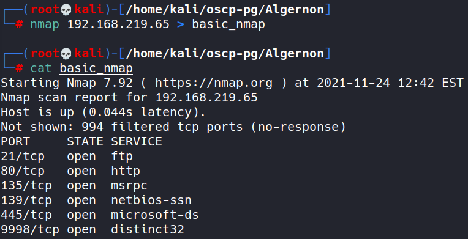

Notice port 80 is open so browse to IP

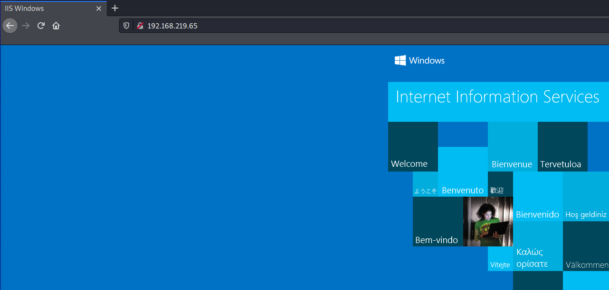
It's IIS, so I wonder if the version is vulnerable

- Ran nmap to check that port specifically:

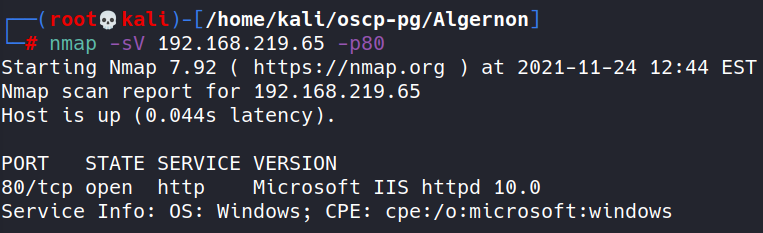

- Ran more detailed nmap scan:

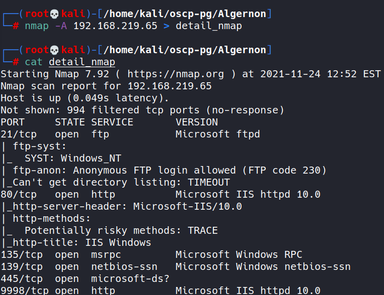

Also looks like nmap thinks it may be windows xp/7

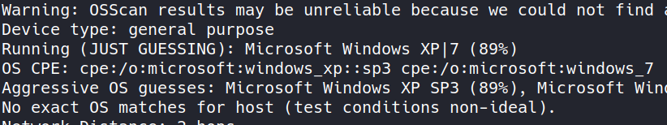

- Noticed from nmap scan that anon ftp login is allowed:

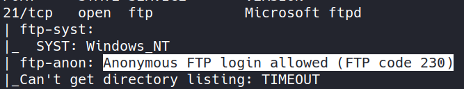

- Logged into FTP using anonymous/anonymous:

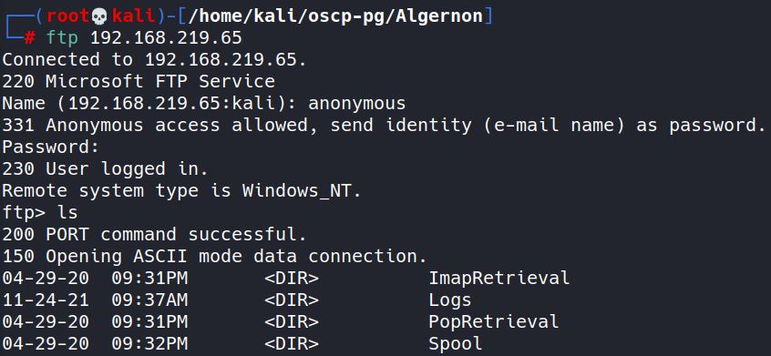

- Found and downloaded file:

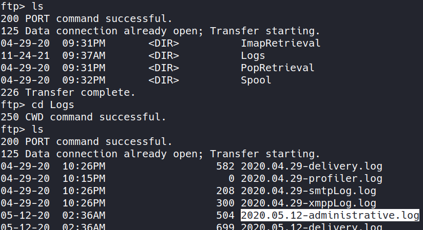
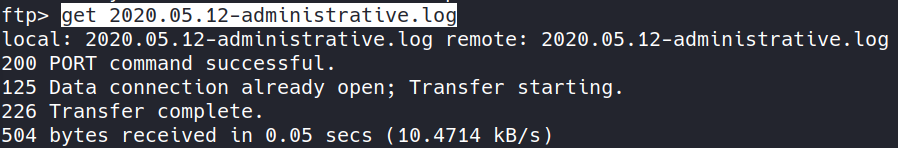

- Opened the file:

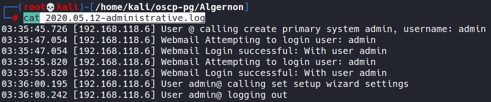

No password as of yet, so shifting gears. Went back to detailed nmap and noticed that IIS is also running on port 9998:

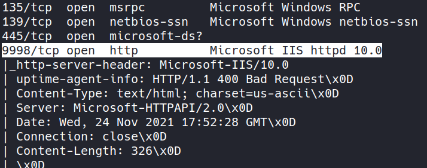

- Browsed to this location and found a login:

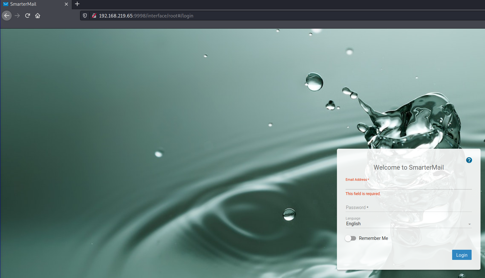

Tried admin/admin credentials (default) and they did not work

- Searched for SmarterMail exploits:

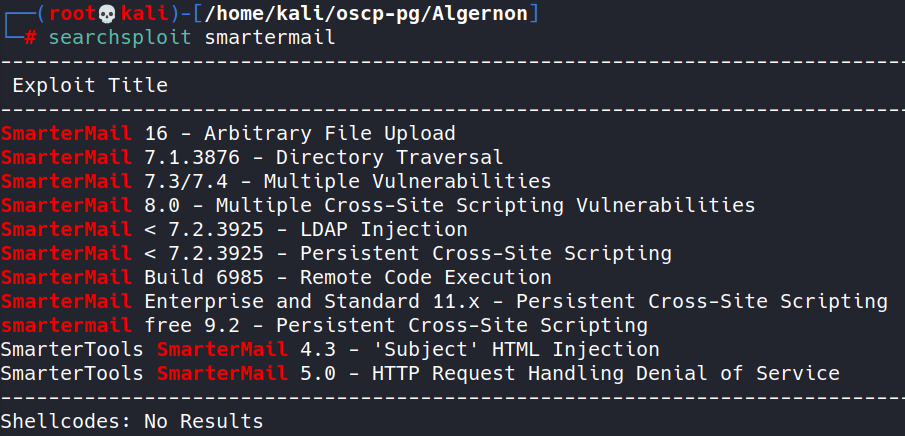

Not sure of build number, but see rce for build 6985. Time to enumerate.

Checked source code on site:

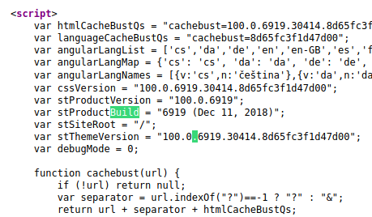

Looks like the exploit is for a version after the one on the server, but it may still be vulnerable

- Download exploit
`searchsploit -m windows/remote/49216.py`

- Looking at exploit

Seems to be trying to use port 17001 by default (I already changed the HOST value to be the target and the LHOST value to be my attack machine Tunnel IP)
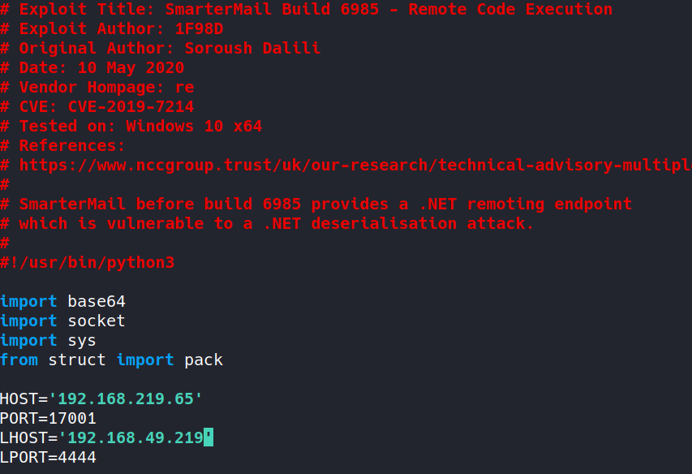

Let's see if port 17001 is open on the target:
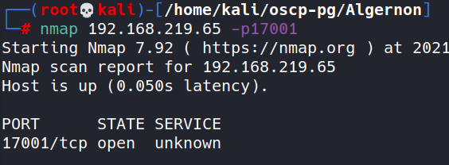

Oh it is! Let's attempt the exploit 

- Set up netcat listener on port 4444

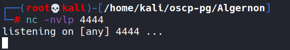

- Run the exploit

Didn't work

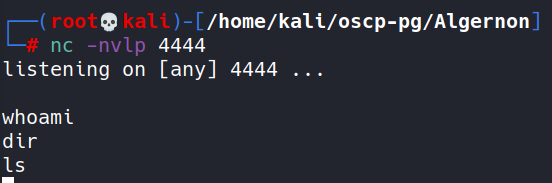

- Experimented with different LPORT values:
-tried 4444, 1234, 123, 443, and none worked. 

- Finally got the exploit to work with port 445:

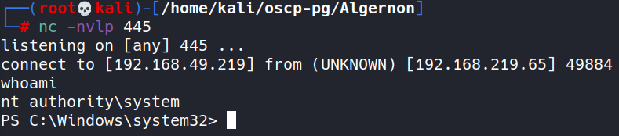

- Not seeing a users.txt, so going straight for proof.txt:

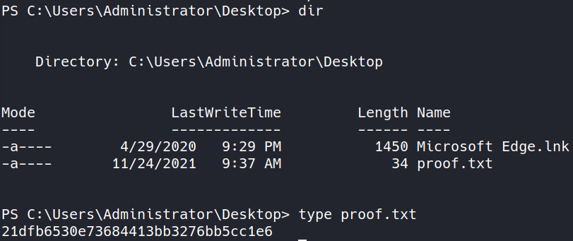

