# Run Nmap to discover ports/services:
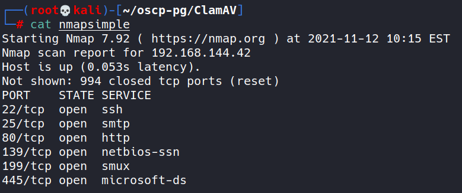

- Tried enumerating webserver by visiting the site since port 80 is open:
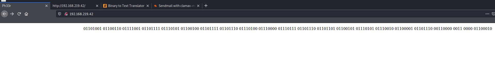
- Then tried to convert binary to ascii:
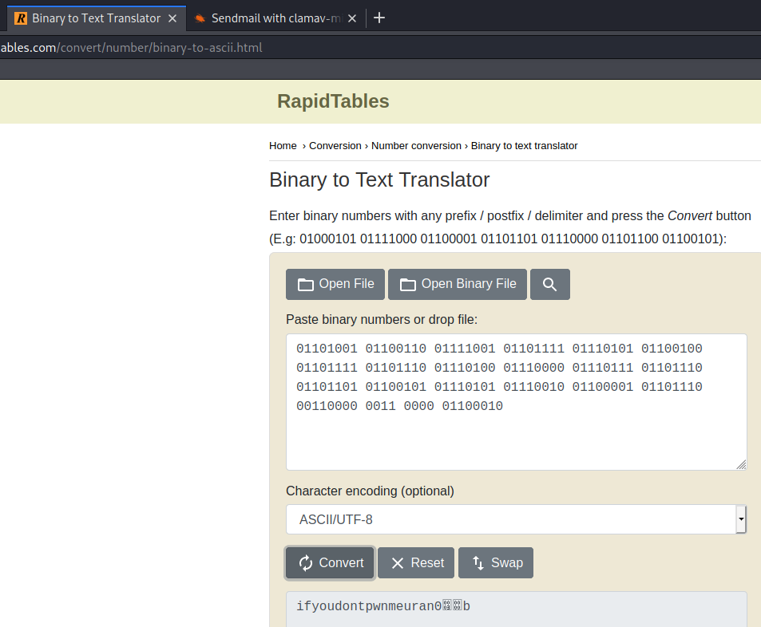
Super helpful
- Viewed source code:
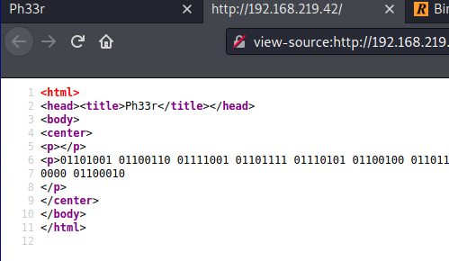

- Decided to run a more detailed nmap scan:
`nmap -A 192.168.144.42`
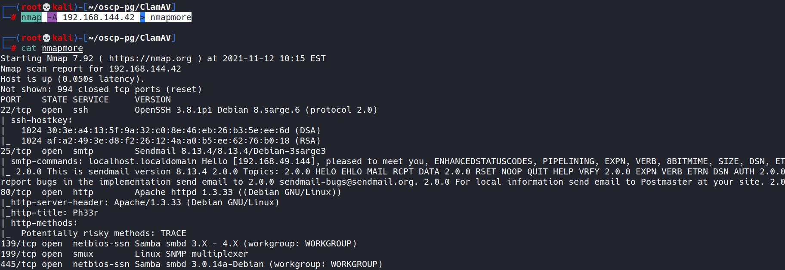

- Saw that SMB was open and tried to enumerate that with no luck really
Figured it was time to check out SMTP on port 25 since it's open and nmap was able to enumerate this a bit:
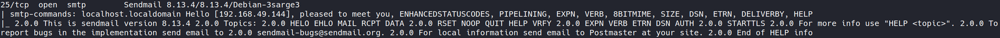

- Decided to search for exploits related to sendmail as that is the service running on port 25:
`searchsploit sendmail`
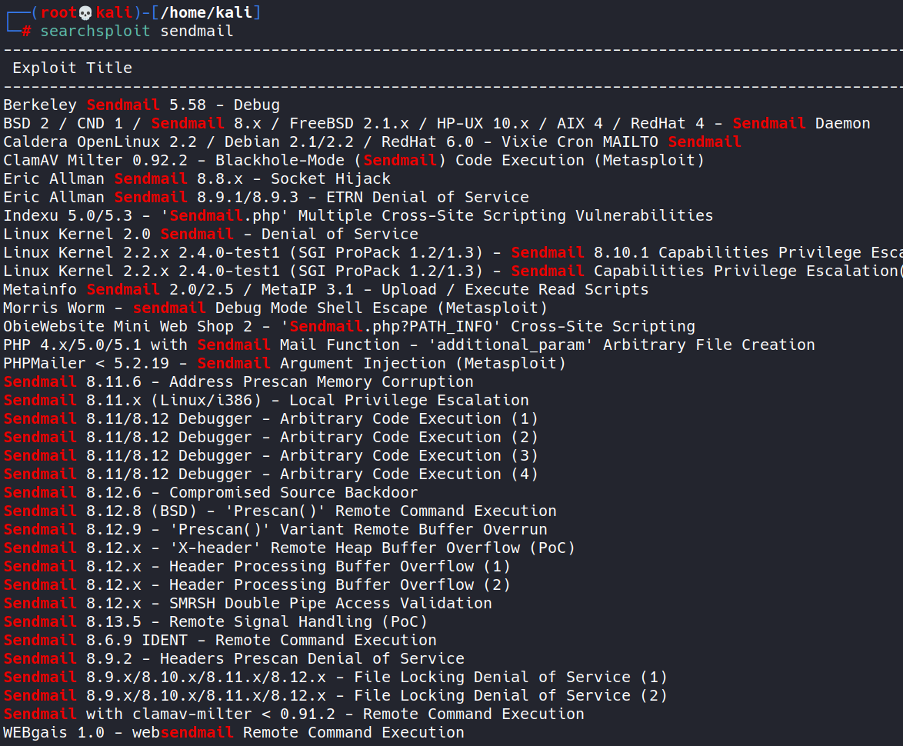
Noticed that a metasploit module exists as well as the next to last entry appears to be a standalone exploit:
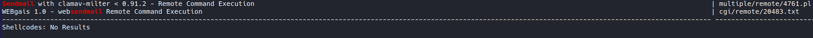

- Downloaded the exploit (non-metasploit version):
`searchsploit -m multiple/remote/4761.pl`

- Opened up the exploit to see what it does:
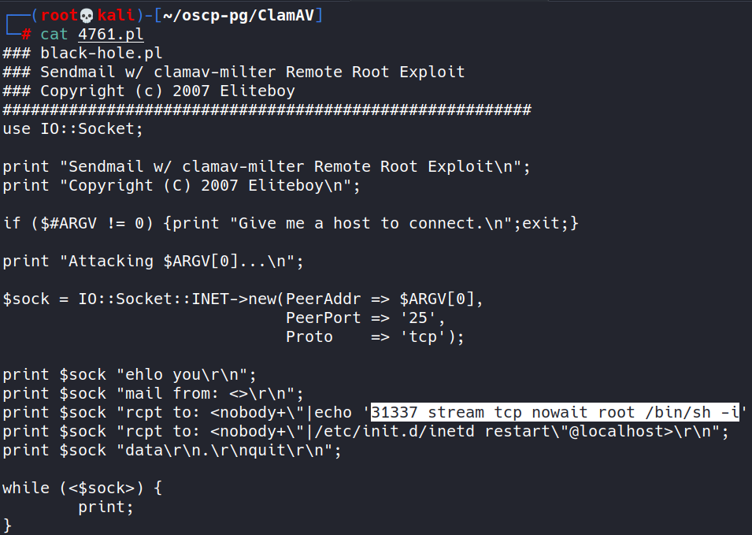
Looks like the exploit communicates with the mail server and opens up port 31337 and executes a root shell on this port

- Tried running the exploit
`perl 4761.pl 192.168.219.42` 
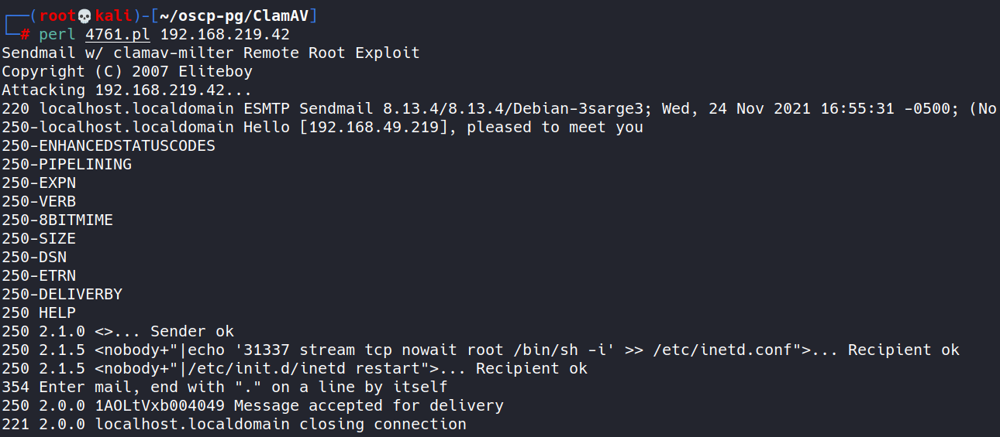
Not noticing any errors

- Check with nmap to see if the port is open now:
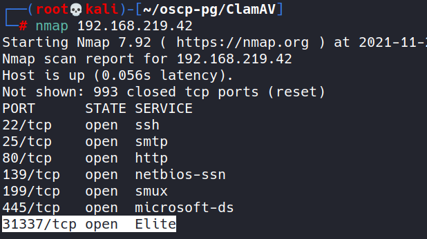
It is!

- Try to connect to port 31337 using netcat:
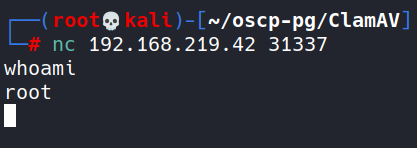

- Use bash -i to upgrade shell minmally:
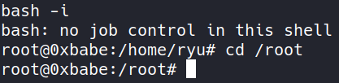

- Found proof.txt:
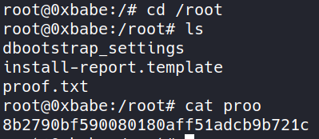