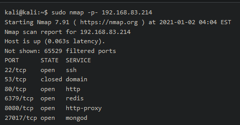
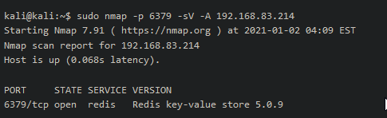
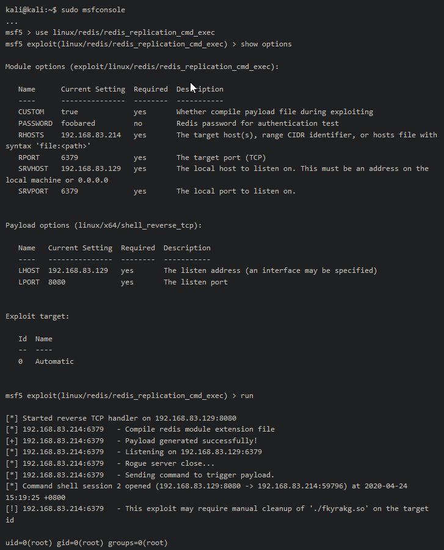

Exploitation Guide for Wombo
Summary

We'll exploit a remote code execution vulnerability in a Redis data store to gain root access to this target.
# Enumeration

## Nmap
Let's begin with a full nmap TCP scan.

Port 6379 is identified as redis. Let's run a more aggressive scan against that port.

This scan indicates that this is version 5.0.9 of the Redis store.

# Exploitation

## RCE

Searching for exploits, we discover a remote code execution vulnerability (which we can of course also locate with searchsploit).

We'll use Metasploit to exploit this service:

This grants us access to a root shell.
