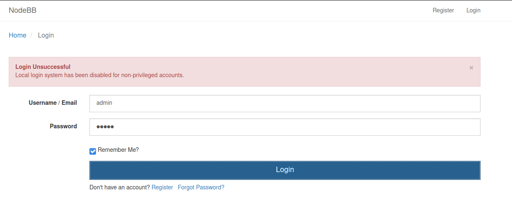

- Basic nmap scan:

- Browsing to IP finding default nginx homepage:

- Browsing to IP at port 8080 is NodeBB:

When clicking login, no login form is returned:

- Ran nikto on host:

`nikto -h 192.168.219.69:8080`

Found some interesting directories

/admin
/compose
/login (OSVDB-3902)
/register (OSVDB-3902)

- Checking out robots.txt:

- Navigating to /admin and trying default creds (admin/admin):

- Nikto returned with wp-app.log indicating this may be a wordpress site:

Nope no wordpress:

Shifting back to the searchsploit exploits for Nodebb, I decide to view the exploidb page for one of the exploits:

Maybe it will let me create a user; I do so using skollr34p3r@gmai.com/skollr34p3r and my account is successfully created.

- Fire up BurpSuite to intercept traffic to website

Navigate to Password change page
Start foxyproxy to allow burp to intercept traffic
Enter current password and password I want to set:
skollr34p3r/skollr34p3r1

hacker
Password123

Password1234

Open up burpsuite. Use burp's embedded browser. Navigate to change password page. Turn on burp intercept.

Enter current password and password you want to change to:

Hit change password and burp opens. Forward the requests until you see:

Send to repeater
Open repeater
Change the "uid" paramater value from 4 to 1:

# The above exploit failed

I got a hint and was told to scan all TCP ports. With a new nmap scan I found a mongod service on port 27017 and redis on port 6379:

All mongo nmap scripts run on this port:

`nmap -sV --script "mongo* and default" -p 27017 192.168.219.69`

Nothing here.

Seems like redis is the way to go. Checking searchsploit:

Checking service version:

Hmm this is a metasploit module. I did some research and found the following repo: https://github.com/Ridter/redis-rce.git

Finally gave up and tried to use metasploit. Even then I was having trouble and had to view the last hint so I went ahead and viewed the walkthrough
