Nmap scan:

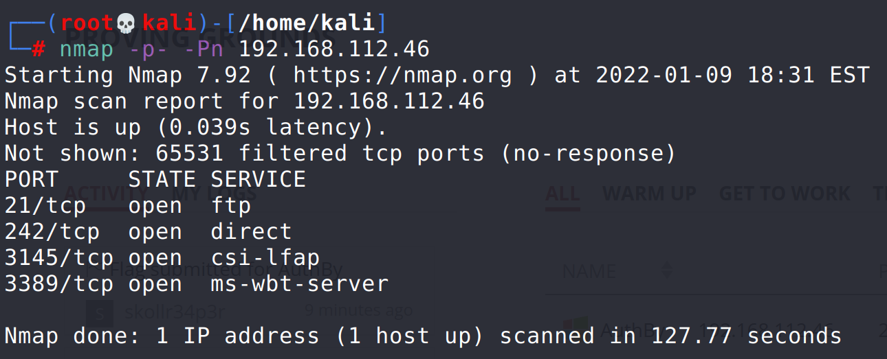

Try anonymous ftp login (anonymous/anonymous):
`ftp 192.168.112.46`
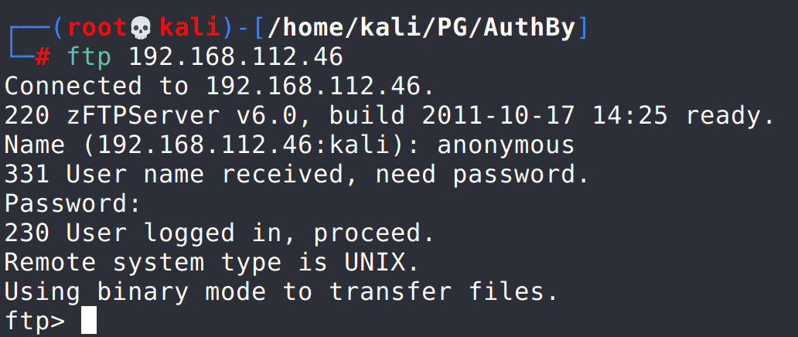

View files:

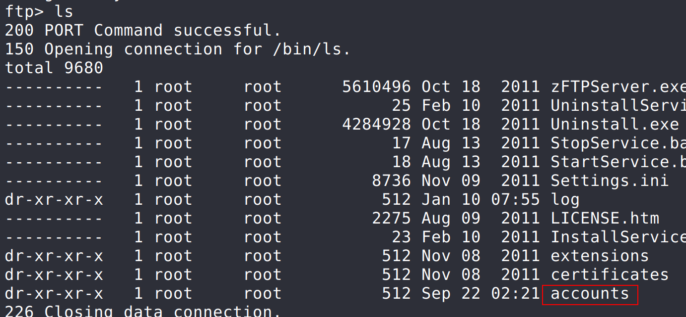

Find account names here:

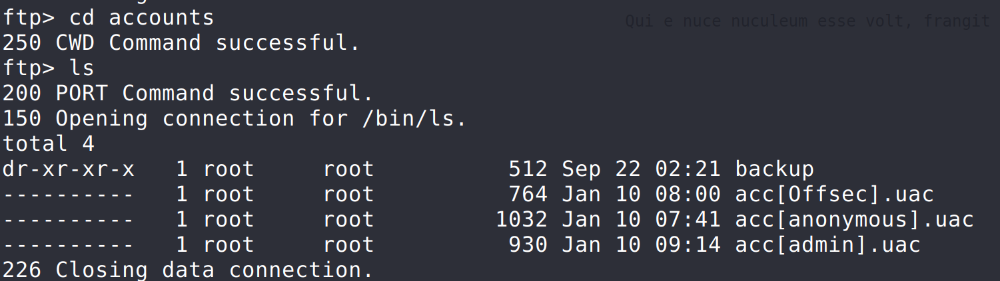

Seeing offsec, admin, and anonymous accounts. Decided to try to log into offsec and admin accounts using ftp with no password and with anonymous password. Didn't work. Finally tried to log into admin with admin and it worked. However, another guide points to port 242 where a login screen is shown:

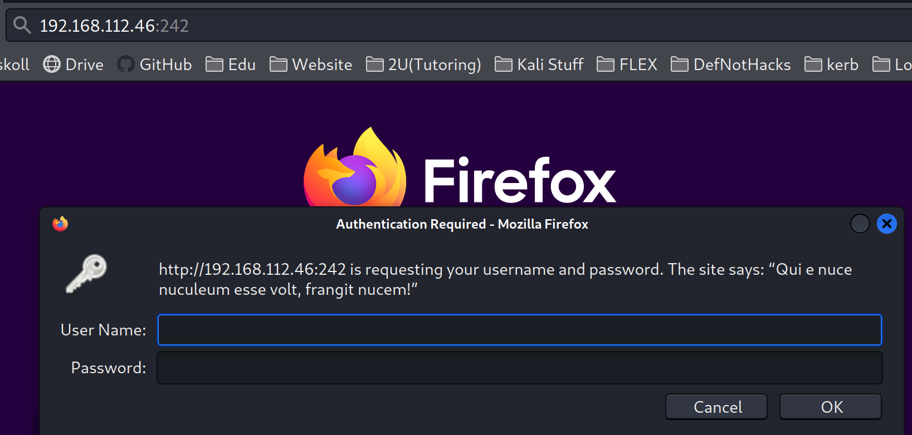

Brute force this login using Hydra:

`hydra -l admin -P /usr/share/wordlists/rockyou.txt 192.168.112.46 ftp –V -f`
Find password admin for account admin.

Now log into ftp using admin/admin to view more files:
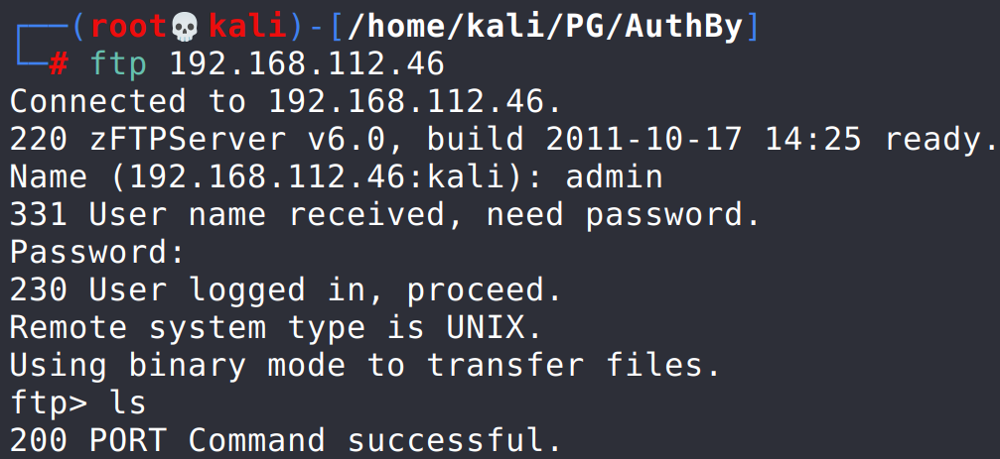
See .htaccess and .htpasswd files:
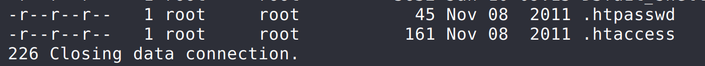
Download files from ftp server:
`get [file_name]`

View files:
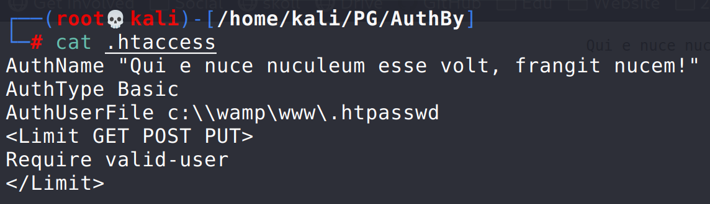
Translate:
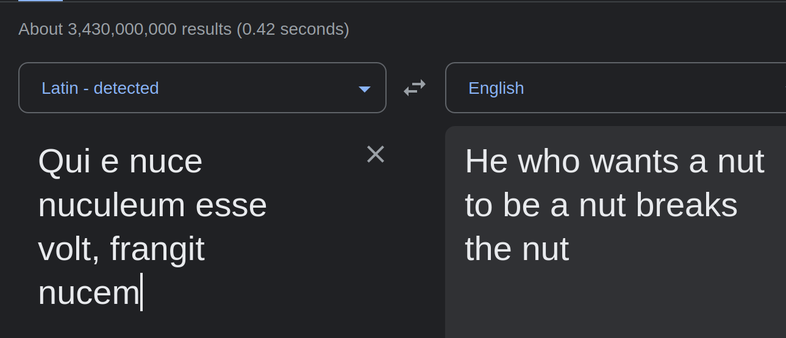

View other file:
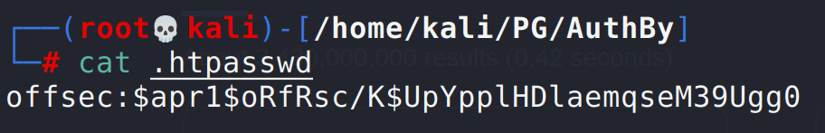

Use John to crack password with rockyou.txt:
`john --wordlist rockyou.txt .htpasswd`
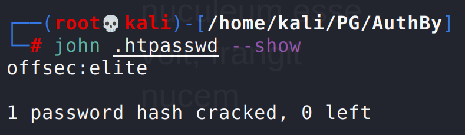
Password for offsec account is elite. Use this to log into website at port 242:
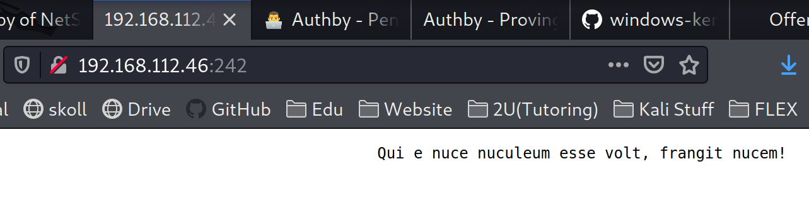

Now I can upload a reverse shell onto the website. Site uses php as shown below, so find a reverse shell payload for Windows (AuthBy is a Windows box):
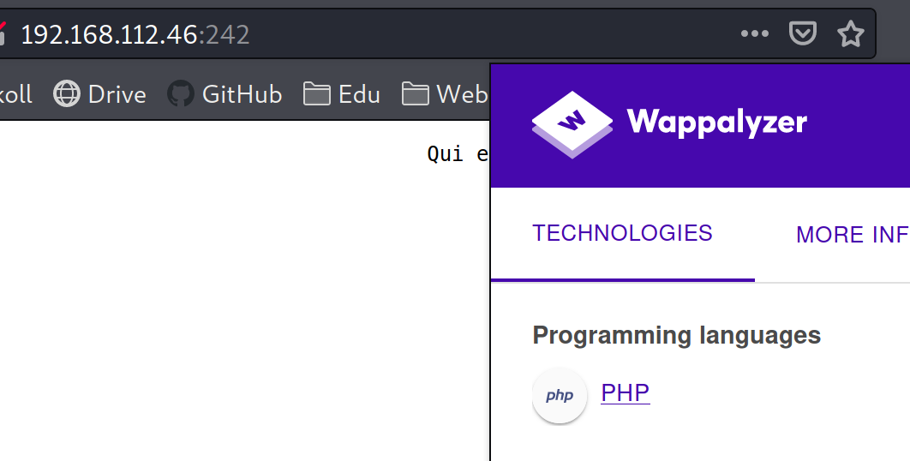
This windows reverse shell worked well:
https://github.com/Dhayalanb/windows-php-reverse-shell

Edit shellcode with attacker IP and port (used 8080). Upload onto the target using the ftp access with admin user:
`put shell.php`

Start netcat listener on port specified in shell.php (8080)
`nc -nlvp 8080`
Append shell.php to website from before (at port 242)
`http://192.168.112.46/shell.php`

This didn't work and I found out it's because of the tmp directory specified by default in that shell.php code. Modifying the $tmpdir variable to set it to C:\\wamp\\www fixes the issue
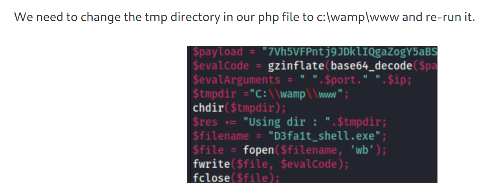

Make the change and rerun the exploit. Netcat returns a shell on the device:
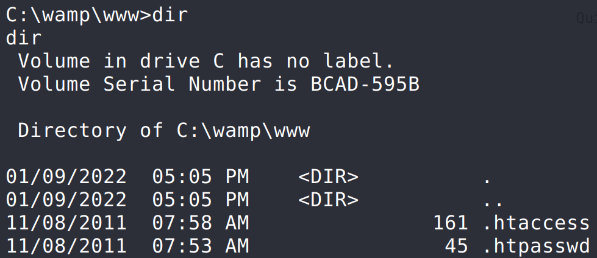

Check logged in user:
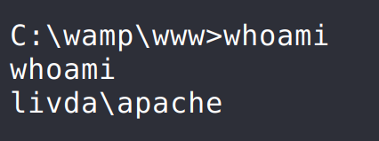

Find user flag in user desktop directory.

Find out more info about the system:
`systeminfo`
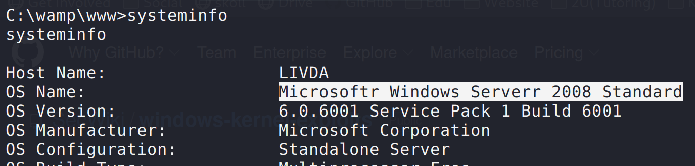

Now looks for exploit for Server 2008 not using metasploit. Found https://github.com/SecWiki/windows-kernel-exploits/tree/master/CVE-2018-8120
This exploit allows a user on a system vulnerable to this exploit to start a new process as SYSTEM. This process can be used to to trigger a windows reverse shell payload.

Download the CVE-2018-8120 exploit. Save as exploit.exe.

Generate windows reverse shell payload named priv.exe using msfvenom:
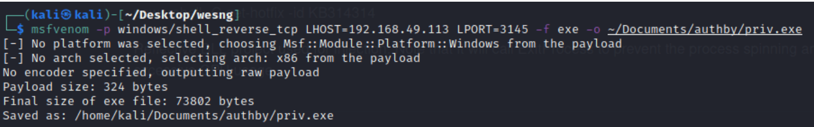

Set up another listener specifying the same port from the windows msfvenom payload (using port found in nmap scan):
`nc -nlvp 3145`

Now use the exploit.exe to trigger the windows reverse shell payload:
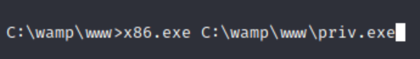

Get a new shell back at the nc listener on port 3145 on the attack machine:
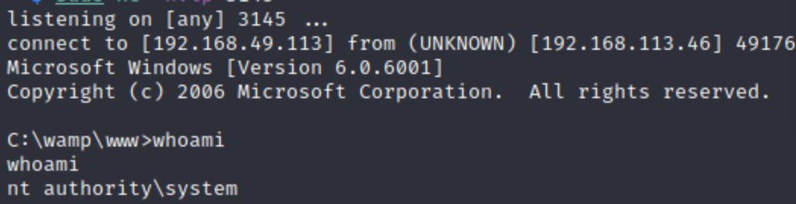

Find root flag in administrator desktop folder!
