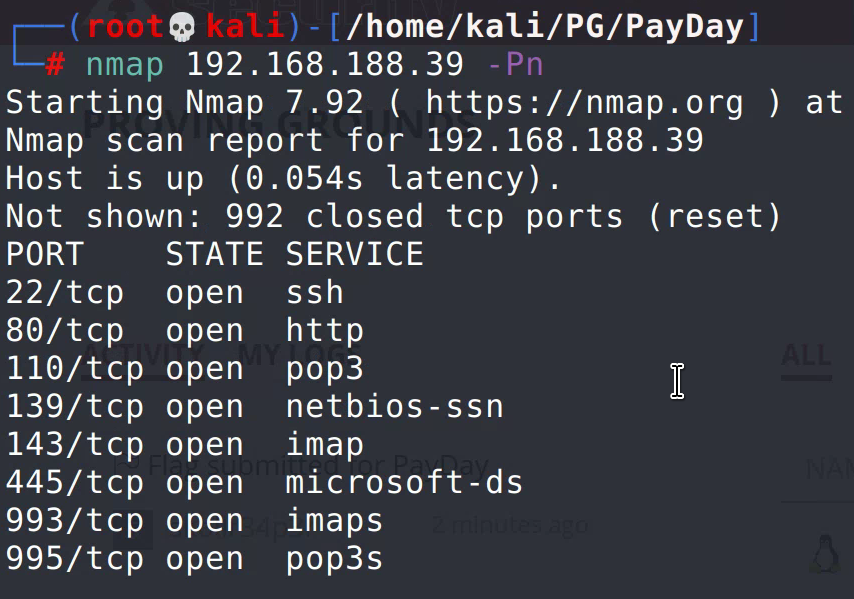
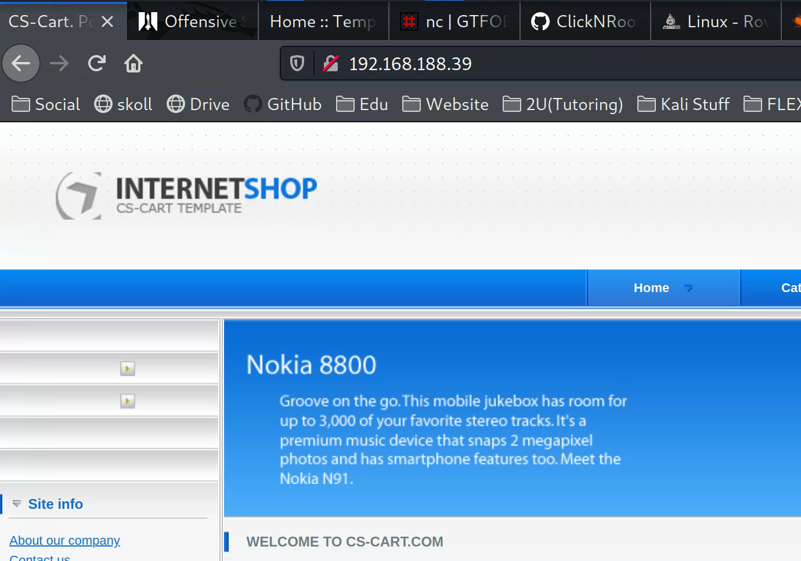
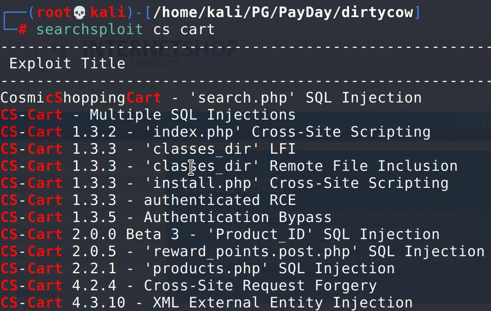
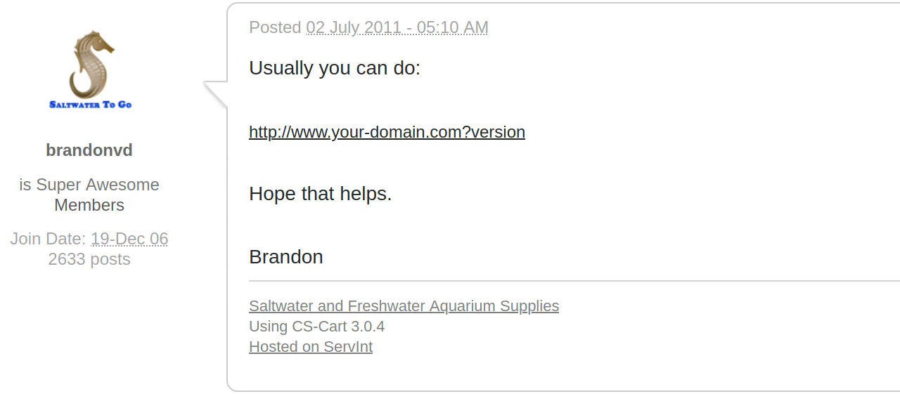
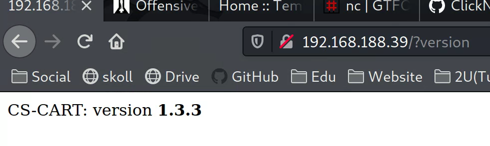
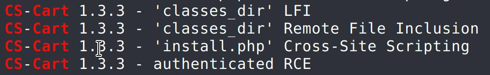
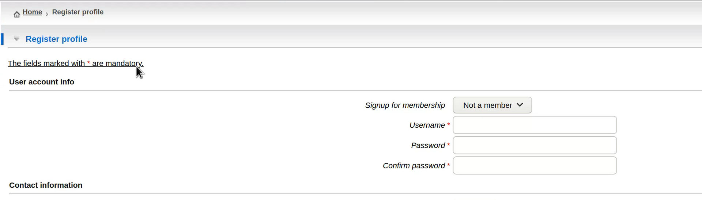
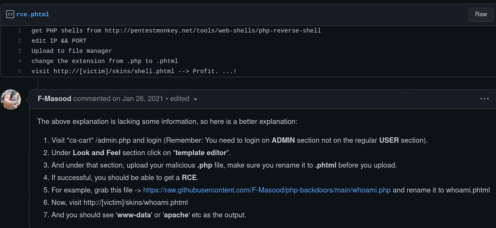

Basic nmap scan

Investigate port 80

Noticing CS cart, check for exploits:

Exploits exist, now check version of cs cart. Google find cs-cart version and found this:

Using this method, found:

Go back to searchploit to check which ones may work:

Decided to try the authenticated rce since I know I can create an account as shown below:

Set up new account and logged in. Instructions for the exploit weren't very clear. Googled around and found this github repo going into more detail: 

Using php reverse shell, able to access system as www-data user. Checked sudo permissions. Nothing.
Got the user flag.

Checked for other users. only one: patrick.

Should have tried to ssh in as patrick using patrick:patrick as it would have worked, but instead I checked kernel. Found that the machine was likely vulnerable to dirtycow and spent way too long trying to compile dirtycow to privesc.

ALL I HAD TO DO WAS LOG INTO SSH USING patrick:patrick, then check sudo permissions and see patrick has full sudo access. sudo su and root access obtained. Got proof.txt in the root directory